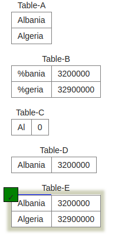

# SQL Project
## Project specifications
> This project required going through quizzes 0 - 9 on **[SQL Zoo](https://sqlzoo.net/wiki/SQL_Tutorial)** 

# Quiz 1

## Question 1

## Answer
`` SELECT name, population FROM world WHERE population BETWEEN 1000000 AND 1250000``

## Question 2
Pick the result you would obtain from this code:
  
``SELECT name, population
      FROM world
      WHERE name LIKE "Al%" ``

## Answer

## Question 3
Select the code which shows the countries that end in A or L

## Answer
``SELECT name FROM world
 WHERE name LIKE '%a' OR name LIKE '%l'``
## Question 4
 Pick the result from the query

 ``SELECT name,length(name)
FROM world
WHERE length(name)=5 and region='Europe'``

## Answer

## Question 5

Pick the result you would obtain from this code:

``SELECT name, area*2 FROM world WHERE population = 64000``
## Answer

 
 ## Question 6
  Select the code that would show the countries with an area larger than 50000 and a population smaller than 10000000
## Answer
``SELECT name, area, population
  FROM world
 WHERE area > 50000 AND population < 10000000``
## Question 7
Select the code that shows the population density of China, Australia, Nigeria and France

## Answer

 ``SELECT name, population/area
  FROM world
 WHERE name IN ('China', 'Nigeria', 'France', 'Australia')``

 #Quiz 2
 

 ## Question 1
 Select the code which gives the name of countries beginning with U

 ## Answer 
 ``SELECT name FROM world WHERE name LIKE 'U%' ``

 ## Question 2
 Select the code which shows just the population of United Kingdom?
 ## Answer 
 ``SELECT population FROM world WHERE name = 'United Kingdom'``

## Question 3
Select the answer which shows the problem with this SQL code - the intended result should be the continent of France:

`` SELECT continent FROM world WHERE 'name' = 'France'``

## Question 4
Select the result that would be obtained from the following code:

`` SELECT name, population / 10 FROM world WHERE population < 10000``

## Answer
 

 ## Question 5 
 Select the code which would reveal the name and population of countries in Europe and Asia

 ## Answer 
 ``SELECT name, population FROM world WHERE continent IN ('Europe', 'Asia')``

 ## Question 6
Select the code which would give two rows

## Answer 
``SELECT name FROM world WHERE name IN ('Cuba', 'Togo')``

## Question 7
Select the result that would be obtained from this code:
``SELECT name FROM world WHERE continent = 'South America' AND population > 40000000``

## Answer 
 

 # Quiz 3
 **nobel table**
 

 ## Question 1
 Pick the code which shows the name of winner's names beginning with C and ending in n

 ## Answer 
 
``SELECT winner FROM nobel  WHERE winner LIKE 'C%' AND winner LIKE '%n'``

## Question 2
Select the code that shows how many Chemistry awards were given between 1950 and 1960

## Answer
`` SELECT COUNT(subject) FROM nobel WHERE subject ='Chemistry' AND yr BETWEEN 1950 and 1960``

## Question 3
Pick the code that shows the amount of years where no Medicine awards were given

## Answer
`` SELECT COUNT(DISTINCT yr) FROM nobel WHERE yr NOT IN (SELECT DISTINCT yr FROM nobel WHERE subject = 'Medicine')``

## Question 4
Select the result that would be obtained from the following code:
`` SELECT subject, winner FROM nobel WHERE winner LIKE 'Sir%' AND yr LIKE '196%'``

## Answer 

## Question 5
Select the code which would show the year when neither a Physics or Chemistry award was given
## Answer 
``SELECT yr FROM nobel WHERE yr NOT IN(SELECT yr FROM nobel WHERE subject IN ('Chemistry','Physics'))``

## Question 6
Select the code which shows the years when a Medicine award was given but no Peace or Literature award was
## Answer 
``SELECT DISTINCT yr FROM nobel WHERE subject='Medicine' AND yr NOT IN(SELECT yr FROM nobel  WHERE subject='Literature') AND yr NOT IN (SELECT yr FROM nobel WHERE subject='Peace')
## Question 7
 Pick the result that would be obtained from the following code:

 `` SELECT subject, COUNT(subject) FROM nobel  WHERE yr ='1960' GROUP BY subject``
## Answer

# Exercise 4 SELECT in SELECT

## Challenge 1
List each country name where the population is larger than that of 'Russia'.
## Answer 

`` SELECT name FROM world WHERE population > (SELECT population FROM world WHERE name='Russia')``

## Challenge 2
Show the countries in Europe with a per capita GDP greater than 'United Kingdom'.
## Answer 
`` SELECT name FROM world WHERE continent IN ('Europe') AND gdp/population > (SELECT gdp/population FROM world WHERE name = 'United Kingdom'); ``

## Challenge 3
List the name and continent of countries in the continents containing either Argentina or Australia. Order by name of the country.

## Answer 
``SELECT name, continent FROM world WHERE continent = (SELECT continent FROM world WHERE name = 'Argentina') OR continent = (SELECT continent FROM world WHERE name = 'Australia') ORDER BY name;``

## Challenge 4
Which country has a population that is more than Canada but less than Poland? Show the name and the population.
## Answer 

``SELECT name, population FROM world WHERE population > (SELECT population FROM world WHERE name = 'Canada') AND population < (SELECT population FROM world WHERE name = 'Poland');``

## Challenge 5
Germany (population 80 million) has the largest population of the countries in Europe. Austria (population 8.5 million) has 11% of the population of Germany.

Show the name and the population of each country in Europe. Show the population as a percentage of the population of Germany. Format should be Albania 3% etc
 ## Answer 
`` SELECT name, CONCAT(ROUND(100* population/(SELECT population FROM world WHERE name = 'Germany')), '%') FROM world WHERE continent = 'Europe';``

## Challenge 6
Which countries have a GDP greater than every country in Europe? [Give the name only.] (Some countries may have NULL gdp values)
## Answer 
``SELECT name FROM world WHERE gdp > ALL(SELECT gdp FROM world WHERE continent = 'Europe' AND gdp > 0)``

## Challenge 7
Find the largest country (by area) in each continent, show the continent, the name and the area:

_______________________________

## 👨🏽‍💻 
👤 **Github: [@ggotora](https://github.com/ggotora)**
👤 **Linkedin: [@gilbert-gotora](https://www.linkedin.com/in/gilbert-gotora/)**

## 🤝 Contributing

Contributions, issues and feature requests are welcome!

Feel free to check the [issues page](https://github.com/ggotora/SQL-Project).

## Show your support

Give a ⭐️ if you like this project!

## 📝 License

This project is [MIT](LICENSE) licensed.